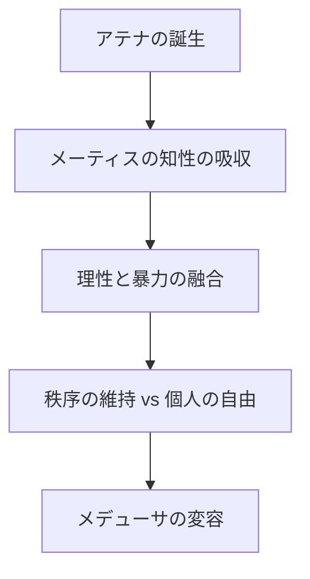
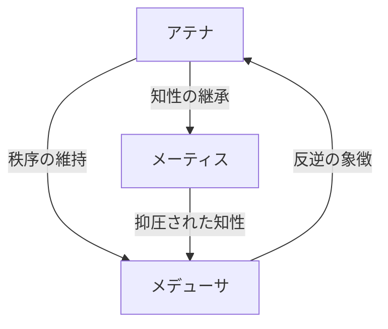

ギリシャ神話の織物において、メデューサ、メーティス、アテナは、権力、知性、変容のテーマを象徴する複雑な三角形を形成している。彼女たちの関係性は、単なる神々間の対立や同盟を超え、存在の本質的な矛盾を浮き彫りにする。以下に、神話的記号学と歴史的文脈を交えながら、その関係性を五つの層から解き明かす。
<!--more-->
### Ⅰ. **創造と破壊の螺旋：アテナの矛盾する本質**

アテナは処女神でありながら、ゼウスの頭から完全武装した状態で生まれたという誕生神話を持つ。この誕生は、メーティス（知恵の女神）がゼウスに飲み込まれた後に起こった。メーティスの「孕まされた知性」がアテナの武神的性質と融合した結果、彼女は「理性による支配」を体現する存在となった。

しかしここで重要なのは、アテナが持つ二面性である。彼女は芸術と戦略の守護者でありながら、オリュンポス十二神中最も戦闘的な女神でもある。この矛盾は、メーティスの知性がゼウスの暴力性と融合した結果生じた「知性の武装化」と言える。

メデューサとの関係性はこの矛盾を顕在化させる。アテナは元々人間であったメデューサを、ポセイドンとの神殿での交わりを理由に、蛇の髪を持つ怪物に変容させた。この行為は、アテナが持つ「秩序の維持」という側面が、他者の自由を犠牲にして成り立っていることを示す。

### Ⅱ. **知恵の抑圧：メーティスの沈黙が意味するもの**

メーティスは「先見の明」を持つ原初的な知恵の女神であり、ゼウスとの結婚を予見し、変身して逃れようとした。しかしゼウスは彼女を飲み込み、その知性を自身に取り込んだ。この行為は、父権制社会における女性的知性の抑圧を象徴している。

興味深いのは、メーティスの知性がアテナの誕生につながったという点だ。これは、抑圧された知性が新たな形で再生することを示唆する。しかしアテナは、母メーティスの直接的な継承者ではなく、父の頭から生まれた「純粋な処女神」として扱われる。この構図は、父権制神話が母系的な知性をどう処理したかを示す典型例である。

メデューサの変容は、この知性の抑圧がもたらす暴力的な結果と言える。アテナがメデューサを罰したのは、単なる神殿の冒涜に対する怒りではなく、メーティスの知性が持つ「秩序への抵抗」の要素を、メデューサに見出したからではないか。

### Ⅲ. **鏡像としての怪物：メデューサの眼差し**

メデューサの「石化の視線」は、単なる呪いではなく、見る者の内面に潜む恐怖を反映する鏡である。彼女は元々美しい人間だったが、アテナの怒りによって怪物に変えられた。この変容は、女性性が「脅威」として再定義されるプロセスを示す。

アテナがメデューサに与えた罰は、表面上は「正義」として機能するが、その本質は女性同士の分断にある。メデューサは、アテナが抑圧した「野生の知性」の化身であり、同時にアテナ自身の影の部分を体現している。ペルセウスがメデューサの首を斬る際、アテナが彼に協力を惜しまなかったのは、自身の影を排除する行為だったと言える。

### Ⅳ. **三女神の三角形：権力と知性と変容**

三者の関係性を幾何学的に分析すると、以下のような構造が浮かび上がる：

この三角形は、権力（アテナ）、知性（メーティス）、変容（メデューサ）が循環的に影響し合うシステムを示している。メーティスの知性はアテナの権力を支えるが、同時にメデューサを通じてその権力への抵抗を生み出す。メデューサの変容は、アテナの秩序維持がもたらす暴力性を暴露する。

### Ⅴ. **現代的解釈：女性性の多重性**

この神話的構図は、現代のジェンダー論にも通じる。アテナは「合理的な女性」、メーティスは「抑圧された母性」、メデューサは「危険視されるセクシュアリティ」をそれぞれ象徴している。彼女たちの関係性は、女性性がいかに複雑な層を持ち、互いに矛盾しながらも共存しているかを示す。

メデューサが持つ「怪物性」は、現代では「他者化された女性性」として再解釈できる。彼女の石化の視線は、社会規範に適合しない女性が受ける非難の目を象徴している。一方、アテナの武神的側面は、女性が社会で成功するために男性的な価値観を内面化せざるを得ない状況を反映している。

### 結論：神話の迷宮からの脱出

メデューサ、メーティス、アテナの関係性は、単なる神話的エピソードではなく、人間存在の根源的な矛盾を浮き彫りにする。彼女たちは、知性と暴力、秩序と自由、創造と破壊が絡み合う迷宮の住人だ。この迷宮から脱出する鍵は、三者の関係性を固定化された物語としてではなく、絶えず再解釈される動的なシステムとして捉えることにある。

メデューサの眼差しは、私たちに問いかける。あなたは石化を恐れ、アテナの盾に隠れるのか？それともメーティスの知性を取り戻し、新たな秩序を創造するのか？神話は答えを与えない。ただ、問いを投げかけ続ける。
